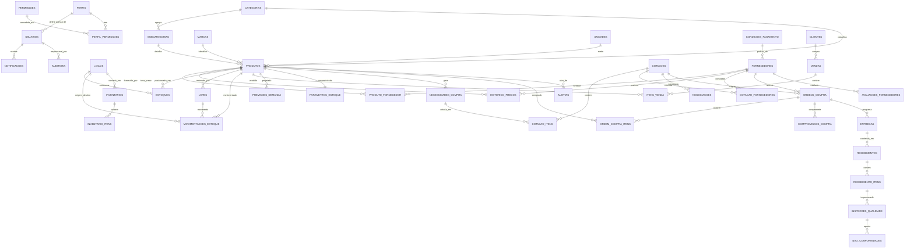

# Modelo de dados

PostgreSQL 16 · 43 tabelas · 5 views · 29 ENUMs · 105 FKs · 74 CHECKs ·
74 UNIQUEs · 165 índices · 69 triggers.

## Migrations

| Arquivo                        | Conteúdo                                                        |
|--------------------------------|-----------------------------------------------------------------|
| `001_base.sql`                 | ENUMs e funções de apoio                                         |
| `002_sistema_usuarios.sql`     | perfis, permissões, usuários, auditoria, configurações           |
| `003_cadastros.sql`            | categorias, subcategorias, marcas, unidades, produtos, fornecedores, condições de pagamento, produto_fornecedor |
| `004_estoque.sql`              | locais, lotes, estoques, movimentações, inventários              |
| `005_demanda.sql`              | clientes, vendas, itens de venda, previsões, parâmetros de estoque |
| `006_compras.sql`              | necessidades, cotações, negociações, ordens de compra, histórico de preços, compromissos |
| `007_logistica_qualidade.sql`  | entregas, recebimentos, inspeções, não conformidades, avaliações |
| `008_alertas.sql`              | alertas e notificações                                           |
| `009_triggers.sql`             | 69 triggers de integridade, auditoria e automação                |
| `010_views.sql`                | 5 views de consulta                                              |

O `migrate.ts` guarda o **checksum SHA-256** de cada arquivo em
`schema_migrations` e recusa rodar se uma migration já aplicada foi alterada.
Cada arquivo roda em sua própria transação.

## Diagrama ER (núcleo)



`configuracoes` e `schema_migrations` são tabelas de infraestrutura, sem
relacionamento, e ficam fora do diagrama.

## Convenções estruturais

**Identidade.** `BIGINT GENERATED ALWAYS AS IDENTITY PRIMARY KEY` — não aceita
valor vindo de fora, evitando descompasso de sequência.

**ENUMs nativos** em vez de CHECK textual: o domínio fica documentado no schema,
o índice é mais compacto e um valor inválido nem chega a ser gravado.

**Soft delete com índice único parcial.** A unicidade só vale para linhas vivas:

```sql
CREATE UNIQUE INDEX ... ON produtos (codigo) WHERE deleted_at IS NULL;
```

Assim um código liberado por exclusão pode ser reaproveitado, sem perder o
histórico.

**Colunas geradas** para valores que são sempre derivados — `quantidade_disponivel`
(física − reservada), `dias_atraso` em entregas, `saving_unitario` em negociações,
`diferenca` em itens de inventário. Não há como ficarem dessincronizados.

**Tabelas append-only.** `auditoria`, `historico_precos` e `movimentacoes_estoque`
recusam UPDATE e DELETE por trigger. A razão de estoque é imutável: correção se
faz com movimentação de ajuste, não apagando o passado.

## Triggers (009)

| Grupo                | O que fazem                                                              |
|----------------------|--------------------------------------------------------------------------|
| `updated_at`         | Atualiza o carimbo de tempo em todas as tabelas (aplicado por loop `DO`)  |
| Autoria              | Preenche `created_by`/`updated_by` a partir de `app.usuario_id`           |
| Auditoria            | Em 21 tabelas críticas, grava só os campos que mudaram, com usuário e IP  |
| Integridade          | Valida que a subcategoria pertence à categoria do produto                 |
| Lotes                | Bloqueia entrada de lote vencido; marca VENCIDO/CONSUMIDO automaticamente |
| Saldo                | Aplica a movimentação em `estoques` e barra saldo negativo (configurável) |
| Imutabilidade        | Bloqueia UPDATE/DELETE em auditoria, histórico de preços e movimentações  |
| Preços               | Preenche `preco_anterior` e gera linha em `historico_precos`              |
| Recebimento          | Aplica a tolerância de excesso parametrizada em `configuracoes`           |

A auditoria ignora `updated_at` e `updated_by` ao comparar valores — do
contrário toda linha teria diferença sempre. `estoques` fica fora da auditoria
de propósito: a razão de movimentações já é o registro completo.

## Views

| View                          | Para que serve                                                                 |
|-------------------------------|---------------------------------------------------------------------------------|
| `vw_estoque_atual`            | Posição consolidada por produto e local, com lotes e valor                       |
| `vw_produtos_criticos`        | Situação de cada SKU: RUPTURA, ABAIXO_SEGURANCA, ABAIXO_MINIMO, PONTO_PEDIDO, EXCESSO, NORMAL — com cobertura em dias |
| `vw_compras_abertas`          | Ordens em aberto, valor comprometido e atraso                                    |
| `vw_historico_precos`         | Evolução de preço por produto/fornecedor, com variação % via `LAG`               |
| `vw_performance_fornecedores` | OTIF, índice de qualidade, atraso médio e ocorrências                            |

## Configurações parametrizáveis

A tabela `configuracoes` guarda 19 parâmetros lidos pelas funções
`fn_config_bool()` e `fn_config_num()` — limites das curvas ABC e XYZ,
tolerância de excesso no recebimento, permissão de estoque negativo, pesos do
score de fornecedor e horizonte de previsão. Mudar comportamento do sistema não
exige deploy.

## Perfis e permissões

Oito perfis: ADMIN, GESTOR_COMPRAS, COMPRADOR, ESTOQUE, QUALIDADE, FINANCEIRO,
COMERCIAL, DIRETORIA. As 73 permissões saem do produto cartesiano
módulo × ação (`ler`, `criar`, `editar`, `excluir`) mais cinco especiais:
`estoque.movimentar`, `ordens_compra.aprovar`, `cotacoes.negociar`,
`recebimentos.conferir` e `qualidade.inspecionar`.

## Nota sobre nomenclatura

As tabelas de itens usam o pai no singular — `cotacao_itens`,
`cotacao_fornecedores`, `ordem_compra_itens`, `recebimento_itens` — em vez de
`cotacoes_itens` / `ordens_compra_itens`, como apareceu em parte da
especificação. O padrão foi unificado para evitar mistura entre os dois estilos
no mesmo schema.
